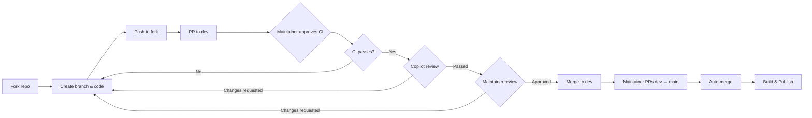

# Contributing

Thanks for your interest in contributing to SearXNG HTTP MCP!

## Workflow



## For External Contributors

1. **Fork** this repository
2. Create a feature branch and make your changes
3. **Push** to your fork
4. Open a **Pull Request to the `dev` branch** (not `main`)
5. **Wait for maintainer to approve CI** — all fork PRs require approval before CI runs
6. **Wait for Copilot code review** — address any feedback, push fixes to the same branch, and resolve comment threads
7. A maintainer will review and merge to `dev`

### Rules

- PRs must target the **`dev`** branch — PRs directly to `main` will be rejected
- Fork PRs **cannot** modify files in the `.github/` directory — if you need CI changes, open an issue
- Follow [Conventional Commits](https://www.conventionalcommits.org/) for commit messages

## For Maintainers

1. Create a feature branch in the upstream repository
2. Develop and push (triggers test.yml automatically)
3. Open a PR to `dev`
4. Wait for Copilot review, address feedback, resolve comments
5. Merge after tests pass
6. When ready to release: create PR `dev` → `main` (auto-merges immediately), triggering build and publish

## Development Setup

```bash
# Clone the repo
git clone https://github.com/whw23/searxng_http_mcp.git
cd searxng_http_mcp

# Create virtual environment
python -m venv .venv
source .venv/bin/activate

# Install dependencies
pip install "mcp[cli]" pytest pytest-anyio httpx pytest-cov pyyaml

# Run tests
pytest tests/ -v
```

## Reviewing External PRs Locally

Use the sandboxed review script to safely test untrusted code:

```bash
./scripts/review-pr.sh <PR_NUMBER>
```

This runs tests in an isolated Docker container with no network access and read-only source.

## Commit Messages

Follow [Conventional Commits](https://www.conventionalcommits.org/):

```text
feat(tools): add new search parameter
fix(proxy): handle timeout errors
docs: update README examples
ci: update workflow triggers
```

## Questions?

Open an [issue](https://github.com/whw23/searxng_http_mcp/issues) if anything is unclear.
