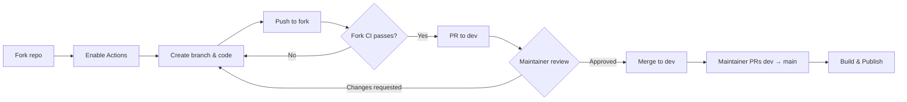

# Contributing

Thanks for your interest in contributing to SearXNG HTTP MCP!

## Workflow



1. **Fork** this repository
2. **Enable GitHub Actions** in your fork (Settings → Actions → General → Allow all actions)
3. Create a feature branch and make your changes
4. **Push** to your fork — CI runs automatically
5. **Wait for CI to pass** in your fork
6. Open a **Pull Request to the `dev` branch** (not `main`)
7. A maintainer will review and merge

## Rules

### PR target

- PRs must target the **`dev`** branch
- PRs directly to `main` will be rejected — `main` is only updated from `dev` by maintainers

### CI must pass in your fork first

**We do not run tests on PR submissions.** All CI must pass in your fork **before** you open a PR. This is enforced automatically — if your fork has no successful CI run for the PR's head commit, the PR cannot be merged.

If you see an error like:

> No successful push-triggered CI run found in your-username/searxng_http_mcp

Make sure:

1. GitHub Actions is enabled in your fork (Settings → Actions → General → Allow all actions)
2. You have pushed your latest commit and the CI workflow has completed successfully

### Protected files

Fork PRs **cannot** modify files in the `.github/` directory (workflows, CI configs). If you need changes to CI, open an issue to discuss.

### Copilot code review

All PRs targeting `dev` are automatically reviewed by GitHub Copilot. The `copilot-review` CI check waits for Copilot to finish its review before passing. If Copilot requests changes, review its suggestions before merging. PRs from `dev` to `main` skip this check since the code has already been reviewed.

### Plugin consistency

If your changes touch `plugins/local/` or `plugins/remote/`, the `skills/` and `agents/` directories must stay identical between the two. The `plugin-consistency` check enforces this.

## Development Setup

```bash
# Clone your fork
git clone https://github.com/YOUR_USERNAME/searxng_http_mcp.git
cd searxng_http_mcp

# Create virtual environment
python -m venv .venv
source .venv/bin/activate

# Install dependencies
pip install "mcp[cli]" pytest pytest-anyio httpx pytest-cov pyyaml

# Run tests
pytest tests/ -v
```

## Commit Messages

Follow [Conventional Commits](https://www.conventionalcommits.org/):

```
feat(tools): add new search parameter
fix(proxy): handle timeout errors
docs: update README examples
ci: update workflow triggers
```

## Questions?

Open an [issue](https://github.com/whw23/searxng_http_mcp/issues) if anything is unclear.
