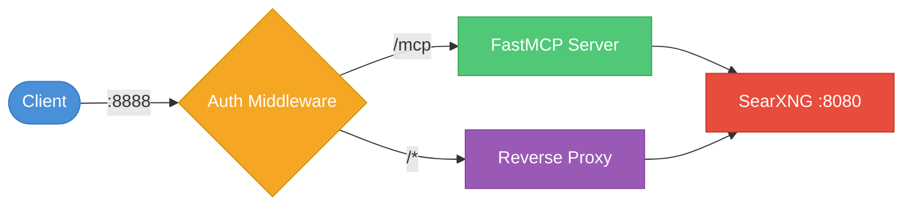

<div align="center">

<picture>
  <source media="(prefers-color-scheme: dark)" srcset="assets/banner-dark.svg">
  <source media="(prefers-color-scheme: light)" srcset="assets/banner-light.svg">
  
</picture>

<p>
  <a href="https://opensource.org/licenses/MIT"></a>
  <a href="https://github.com/whw23/searxng_http_mcp/pkgs/container/searxng-http-mcp"></a>
  <a href="https://github.com/whw23/searxng_http_mcp/actions/workflows/build.yml"></a>
  
  
  
</p>

<p>
  <a href="#quick-start">Quick Start</a> ·
  <a href="#features">Features</a> ·
  <a href="#architecture">Architecture</a> ·
  <a href="#comparison-with-alternatives">Comparison</a> ·
  <a href="#usage">Usage</a> ·
  <a href="#mcp-tools-reference">MCP Tools</a> ·
  <a href="#client-configuration">Client Config</a> ·
  <a href="#claude-code-plugin">Plugin</a> ·
  <a href="#contributing">Contributing</a>
</p>

</div>

---

## Quick Start

```bash
docker run -d --name searxng-mcp --restart unless-stopped \
  -p 8888:8888 --memory=512m --cpus=1 \
  ghcr.io/whw23/searxng-http-mcp:latest
```

That's it. SearXNG + MCP server running on port 8888.

## Features

<table>
<tr>
  <td width="50%">

  - 📦 **Self-contained** — SearXNG built into the Docker image
  - 🔄 **Dual transport** — HTTP (Streamable HTTP) and stdio
  - 🔐 **Authentication** — `x-api-key` + HTTP Basic Auth
  - 🌐 **Reverse proxy** — SearXNG Web UI on the same port

  </td>
  <td width="50%">

  - 📄 **Multi-page fanout** — up to 5 pages per call
  - ⚡ **Dynamic tool descriptions** — live engine/category lists
  - 🎯 **Token-efficient** — results trimmed to essentials
  - 🧩 **Claude Code Plugin** — self-hosted marketplace

  </td>
</tr>
</table>

## Architecture



## Comparison with Alternatives

<table>
<thead>
  <tr>
    <th>Feature</th>
    <th style="background:#e8f5e9">✨ This project</th>
    <th><a href="https://github.com/ihor-sokoliuk/mcp-searxng">mcp-searxng</a></th>
    <th><a href="https://github.com/aicrafted/searxng-mcp">searxng-mcp</a></th>
    <th><a href="https://github.com/burakaydinofficial/searxng-deepdive">searxng-deepdive</a></th>
    <th><a href="https://github.com/exa-labs/exa-mcp-server">exa-mcp-server</a></th>
  </tr>
</thead>
<tbody>
  <tr><td>Free &amp; open source</td><td align="center" style="background:#f1f8e9">&#9989;</td><td align="center">&#9989;</td><td align="center">&#9989;</td><td align="center">&#9989;</td><td align="center">&#10060; (paid API)</td></tr>
  <tr><td>Zero-install Docker deploy</td><td align="center" style="background:#f1f8e9">&#9989;</td><td align="center">&#10060;</td><td align="center">&#10060;</td><td align="center">&#10060;</td><td align="center">&#10060;</td></tr>
  <tr><td>Self-contained (built-in SearXNG)</td><td align="center" style="background:#f1f8e9">&#9989;</td><td align="center">&#10060;</td><td align="center">&#10060;</td><td align="center">&#10060;</td><td align="center">N/A</td></tr>
  <tr><td>Privacy (self-hosted)</td><td align="center" style="background:#f1f8e9">&#9989;</td><td align="center">&#9989;</td><td align="center">&#9989;</td><td align="center">&#9989;</td><td align="center">&#10060;</td></tr>
  <tr><td>Authentication</td><td align="center" style="background:#f1f8e9">&#9989;</td><td align="center">&#10060;</td><td align="center">&#10060;</td><td align="center">&#10060;</td><td align="center">&#9989;</td></tr>
  <tr><td>HTTP + stdio transport</td><td align="center" style="background:#f1f8e9">&#9989;</td><td align="center">&#9989;</td><td align="center">&#9989;</td><td align="center">&#10060;</td><td align="center">&#10060;</td></tr>
  <tr><td>Multi-page fanout</td><td align="center" style="background:#f1f8e9">&#9989;</td><td align="center">&#10060;</td><td align="center">&#10060;</td><td align="center">&#9989;</td><td align="center">&#10060;</td></tr>
  <tr><td>Dynamic tool descriptions</td><td align="center" style="background:#f1f8e9">&#9989;</td><td align="center">&#10060;</td><td align="center">&#10060;</td><td align="center">&#9989;</td><td align="center">&#10060;</td></tr>
  <tr><td>Claude Code Plugin</td><td align="center" style="background:#f1f8e9">&#9989;</td><td align="center">&#10060;</td><td align="center">&#10060;</td><td align="center">&#10060;</td><td align="center">&#10060;</td></tr>
  <tr><td>Web UI reverse proxy</td><td align="center" style="background:#f1f8e9">&#9989;</td><td align="center">&#10060;</td><td align="center">&#10060;</td><td align="center">&#10060;</td><td align="center">&#10060;</td></tr>
  <tr><td>Language</td><td align="center" style="background:#f1f8e9">Python</td><td align="center">Node.js</td><td align="center">Python</td><td align="center">Node.js</td><td align="center">TypeScript</td></tr>
</tbody>
</table>

## Usage

### HTTP Mode (default)

```bash
# Without authentication
docker run -d --name searxng-mcp --restart unless-stopped \
  -p 8888:8888 --memory=512m --cpus=1 \
  ghcr.io/whw23/searxng-http-mcp:latest

# With authentication
docker run -d --name searxng-mcp --restart unless-stopped \
  -p 8888:8888 --memory=512m --cpus=1 \
  -e API_KEY=your-secret-key \
  ghcr.io/whw23/searxng-http-mcp:latest
```

| Endpoint | URL |
| --- | --- |
| MCP | `http://localhost:8888/mcp/` |
| SearXNG Web UI | `http://localhost:8888/` |

### stdio Mode

```bash
docker run --rm -i --memory=512m --cpus=1 \
  ghcr.io/whw23/searxng-http-mcp:latest --stdio
```

No ports exposed. Communication via stdin/stdout. SearXNG runs internally for the MCP tools.

### Environment Variables

| Variable | Default | Description |
| --- | --- | --- |
| `API_KEY` | *(empty, no auth)* | API key for authentication |
| `SEARXNG_URL` | `http://127.0.0.1:8080` | Internal SearXNG URL (rarely needs change) |

### Authentication

When `API_KEY` is set, all requests require one of:

- **`x-api-key` header** — for MCP clients: `x-api-key: your-key`
- **HTTP Basic Auth** — for browsers

> **Browser Login:** When accessing the Web UI with `API_KEY` enabled, the browser will show a login dialog. **Leave the username empty** and enter your API key as the **password**.

When `API_KEY` is not set, all requests are open.

## MCP Tools Reference

<details>
<summary><code>search</code> — Search the web using SearXNG</summary>

<br>

Aggregates results from multiple search engines.

| Parameter | Type | Required | Default | Description |
| --- | --- | --- | --- | --- |
| `query` | str | yes | — | Search query string |
| `categories` | str | no | "" | Comma-separated: general, images, videos, news, it, etc. |
| `language` | str | no | "" | Language code (e.g., zh, en, ja) |
| `time_range` | str | no | "" | day, month, year |
| `safesearch` | int | no | 0 | 0=off, 1=moderate, 2=strict |
| `pageno` | int | no | 1 | Starting page number |
| `pages` | int | no | 1 | Number of pages to fetch (1-5) |
| `engines` | str | no | "" | Comma-separated engine names (e.g., google,bing) |

Returns: results, answers, suggestions, corrections, infoboxes.

</details>

<details>
<summary><code>autocomplete</code> — Get search query suggestions</summary>

<br>

| Parameter | Type | Required | Description |
| --- | --- | --- | --- |
| `query` | str | yes | Query string to autocomplete |

</details>

## Client Configuration

<details>
<summary><b>Claude Desktop</b></summary>

**Server mode** — edit `~/Library/Application Support/Claude/claude_desktop_config.json`:

```json
{
  "mcpServers": {
    "searxng": {
      "url": "http://your-server:8888/mcp/",
      "headers": {
        "x-api-key": "your-secret-key"
      }
    }
  }
}
```

**Local mode**:

```json
{
  "mcpServers": {
    "searxng": {
      "command": "docker",
      "args": ["run", "--rm", "-i", "--memory=512m", "--cpus=1", "ghcr.io/whw23/searxng-http-mcp:latest", "--stdio"]
    }
  }
}
```

</details>

<details>
<summary><b>Claude Code</b></summary>

**Server mode**:

```bash
claude mcp add searxng --transport http http://your-server:8888/mcp/ -- --header "x-api-key: your-secret-key"
```

**Local mode**:

```bash
claude mcp add searxng -- docker run --rm -i --memory=512m --cpus=1 ghcr.io/whw23/searxng-http-mcp:latest --stdio
```

</details>

<details>
<summary><b>Cursor</b></summary>

**Server mode** — add to Cursor MCP settings:

```json
{
  "mcpServers": {
    "searxng": {
      "url": "http://your-server:8888/mcp/",
      "headers": {
        "x-api-key": "your-secret-key"
      }
    }
  }
}
```

**Local mode**:

```json
{
  "mcpServers": {
    "searxng": {
      "command": "docker",
      "args": ["run", "--rm", "-i", "--memory=512m", "--cpus=1", "ghcr.io/whw23/searxng-http-mcp:latest", "--stdio"]
    }
  }
}
```

</details>

<details>
<summary><b>VS Code Copilot</b></summary>

**Server mode** — add to `.vscode/mcp.json`:

```json
{
  "servers": {
    "searxng": {
      "url": "http://your-server:8888/mcp/",
      "headers": {
        "x-api-key": "your-secret-key"
      }
    }
  }
}
```

**Local mode**:

```json
{
  "servers": {
    "searxng": {
      "command": "docker",
      "args": ["run", "--rm", "-i", "--memory=512m", "--cpus=1", "ghcr.io/whw23/searxng-http-mcp:latest", "--stdio"]
    }
  }
}
```

</details>

<details>
<summary><b>Windsurf</b></summary>

**Server mode** — add to `~/.codeium/windsurf/mcp_config.json`:

```json
{
  "mcpServers": {
    "searxng": {
      "url": "http://your-server:8888/mcp/",
      "headers": {
        "x-api-key": "your-secret-key"
      }
    }
  }
}
```

**Local mode**:

```json
{
  "mcpServers": {
    "searxng": {
      "command": "docker",
      "args": ["run", "--rm", "-i", "--memory=512m", "--cpus=1", "ghcr.io/whw23/searxng-http-mcp:latest", "--stdio"]
    }
  }
}
```

</details>

<details>
<summary><b>Cline</b></summary>

Configure via Cline's MCP settings panel in VS Code (`Cline > MCP Servers > Add`).

**Server mode**:

```json
{
  "mcpServers": {
    "searxng": {
      "url": "http://your-server:8888/mcp/",
      "headers": {
        "x-api-key": "your-secret-key"
      }
    }
  }
}
```

**Local mode**:

```json
{
  "mcpServers": {
    "searxng": {
      "command": "docker",
      "args": ["run", "--rm", "-i", "--memory=512m", "--cpus=1", "ghcr.io/whw23/searxng-http-mcp:latest", "--stdio"]
    }
  }
}
```

</details>

<details>
<summary><b>Continue.dev</b></summary>

**Server mode** — add to `~/.continue/config.yaml`:

```yaml
mcpServers:
  - name: searxng
    url: "http://your-server:8888/mcp/"
    headers:
      x-api-key: "your-secret-key"
```

**Local mode**:

```yaml
mcpServers:
  - name: searxng
    command: docker
    args: ["run", "--rm", "-i", "--memory=512m", "--cpus=1", "ghcr.io/whw23/searxng-http-mcp:latest", "--stdio"]
```

</details>

<details>
<summary><b>OpenCode</b></summary>

**Server mode** — edit `.opencode.json`:

```json
{
  "mcpServers": {
    "searxng": {
      "type": "sse",
      "url": "http://your-server:8888/mcp/",
      "headers": {
        "x-api-key": "your-secret-key"
      }
    }
  }
}
```

**Local mode**:

```json
{
  "mcpServers": {
    "searxng": {
      "type": "stdio",
      "command": "docker",
      "args": ["run", "--rm", "-i", "--memory=512m", "--cpus=1", "ghcr.io/whw23/searxng-http-mcp:latest", "--stdio"]
    }
  }
}
```

</details>

<details>
<summary><b>Hermes Agent</b></summary>

**Server mode** — edit `~/.hermes/config.yaml`:

```yaml
mcp_servers:
  searxng:
    url: "http://your-server:8888/mcp/"
    headers:
      x-api-key: "your-secret-key"
```

**Local mode**:

```yaml
mcp_servers:
  searxng:
    command: "docker"
    args: ["run", "--rm", "-i", "--memory=512m", "--cpus=1", "ghcr.io/whw23/searxng-http-mcp:latest", "--stdio"]
```

</details>

## Claude Code Plugin

Install via self-hosted marketplace:

```bash
/plugin marketplace add whw23/searxng_http_mcp
/plugin install searxng-http-mcp@searxng-http-mcp
```

The plugin includes:

- **MCP server config** — pre-configured for local Docker stdio mode (works out of the box)
- **`/search` skill** — web search skill for Claude Code
- **`/setup` skill** — interactive setup to switch between local and server mode

By default the plugin uses **local mode** (Docker stdio). To switch modes, run:

```bash
/setup
```

## SearXNG Configuration

### Via Web UI

Access the SearXNG Web UI at `http://localhost:8888/` to configure search engines, languages, and other settings. Changes persist during the container's lifetime.

### Via Volume Mount

Mount the SearXNG config directory for persistent configuration:

```bash
docker run -d --name searxng-mcp --restart unless-stopped \
  -p 8888:8888 --memory=512m --cpus=1 \
  -v /path/to/searxng-config:/etc/searxng \
  ghcr.io/whw23/searxng-http-mcp:latest
```

SearXNG generates `settings.yml` on first startup. The container automatically enables JSON format output required by MCP tools.

## Build from Source

```bash
git clone https://github.com/whw23/searxng_http_mcp.git
cd searxng-http-mcp
docker build -t searxng-http-mcp:local .
docker run -d --name searxng-mcp --restart unless-stopped \
  -p 8888:8888 --memory=512m --cpus=1 \
  searxng-http-mcp:local
```

## Contributing

1. Fork the repository
2. Create a feature branch from `dev`
3. Make your changes
4. Run tests: `pytest tests/ -v`
5. Submit a PR to `dev`

Development happens on the `dev` branch. Merges to `main` trigger image builds.

## License

[MIT](LICENSE) — MCP server code.

SearXNG itself is licensed under [AGPL-3.0-or-later](https://github.com/searxng/searxng/blob/master/LICENSE).
