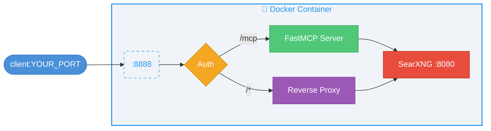
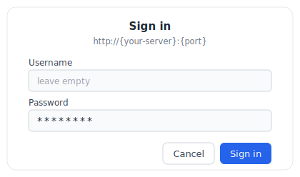

<div align="center">

<picture>
  <source media="(prefers-color-scheme: dark)" srcset="assets/banner-dark.svg">
  <source media="(prefers-color-scheme: light)" srcset="assets/banner-light.svg">
  
</picture>

<p>
  <a href="https://github.com/whw23/searxng_http_mcp/blob/main/LICENSE"></a>
  <a href="https://github.com/whw23/searxng_http_mcp/pkgs/container/searxng-http-mcp"></a>
  <a href="https://github.com/whw23/searxng_http_mcp/actions/workflows/build.yml"></a>
  
  
  
  <a href="https://pypi.org/project/searxng-http-mcp/"></a>
  <a href="https://registry.modelcontextprotocol.io/?q=io.github.whw23/searxng-http-mcp"></a>
  <a href="https://scorecard.dev/viewer/?uri=github.com/whw23/searxng_http_mcp"></a>
  <a href="https://www.bestpractices.dev/projects/12854"></a>
  <a href="https://github.com/punkpeye/awesome-mcp-servers"></a>
  <a href="https://glama.ai/mcp/servers/whw23/searxng_http_mcp"></a>
</p>

<a href="https://glama.ai/mcp/servers/whw23/searxng_http_mcp"></a>

<p>
  <a href="README.zh-CN.md">中文</a> ·
  <a href="#-quick-start">Quick Start</a> ·
  <a href="#-features">Features</a> ·
  <a href="#-architecture">Architecture</a> ·
  <a href="#-comparison-with-alternatives">Comparison</a> ·
  <a href="#-usage">Usage</a> ·
  <a href="#-mcp-tools-reference">MCP Tools</a> ·
  <a href="#-client-configuration">Client Config</a> ·
  <a href="#-ai-coding-agent-plugin">Plugin</a> ·
  <a href="#-contributing">Contributing</a>
</p>

</div>

A self-contained MCP server that wraps [SearXNG](https://github.com/searxng/searxng) — a free, privacy-respecting metasearch engine that aggregates results from 200+ search engines.

---

## 🚀 Quick Start

**Server mode** — deploy once, connect from any client:

```bash
docker run -d --name searxng-mcp --restart unless-stopped \
  -p YOUR_PORT:8888 --memory=512m --cpus=1 \
  ghcr.io/whw23/searxng-http-mcp:latest
```

Then [connect your client](#-client-configuration) to `http://YOUR_HOST:YOUR_PORT/mcp/`. To enable API key auth, see [Authentication](#-authentication).

**Local mode** — no server needed, run directly in your client:

```bash
docker run --rm -i --memory=512m --cpus=1 ghcr.io/whw23/searxng-http-mcp:latest --stdio
```

Add this as a stdio MCP server in your client — see [Client Configuration](#-client-configuration) for details.

**uvx mode** — if you already have SearXNG running ([install guide](https://docs.searxng.org/admin/installation.html)):

```bash
uvx searxng-http-mcp
```

Set `SEARXNG_URL` to point to your SearXNG instance (default: `http://127.0.0.1:8080`).

## ✨ Features

### Search

- 🔍 200+ search engines — Google, Bing, DuckDuckGo, Brave, and more via SearXNG
- 📂 30+ categories — news, images, videos, science, IT, and more
- 📄 Multi-page fanout — up to 5 pages per call
- 💡 Autocomplete suggestions — discover relevant search terms
- 🗂 Engine discovery — query available engines grouped by category
- 🎯 Token-efficient — results trimmed to essentials

### Infrastructure

- 📦 Self-contained — SearXNG built into Docker image
- 🔄 Triple transport — HTTP server, Docker stdio, and uvx standalone
- 🔐 Authentication — `x-api-key` + HTTP Basic Auth
- 🌐 Reverse proxy — SearXNG Web UI on the same port
- ⚡ Dynamic tool descriptions — live category lists injected at startup
- 📐 Rich JSON Schema — enum constraints, range limits, and descriptions on every parameter

## 🏛 Architecture



## 📊 Comparison with Alternatives

<details>
<summary>Why these five?</summary>

There are [20+ SearXNG MCP servers](https://glama.ai/mcp/servers?query=searxng) and many more general-purpose search MCPs. Most SearXNG wrappers only expose a basic search tool, leaving SearXNG's categories, autocomplete, and engine metadata unused. We picked five alternatives that each represent a distinct category:

- **88plug/searxng-mcp** — richest tool surface among SearXNG MCPs (7 tools: rendered fetch, research mode, parallel queries)
- **ihor/mcp-searxng** — most GitHub stars among SearXNG MCPs
- **open-webSearch** — top free multi-engine alternative outside the SearXNG ecosystem (Bing, Baidu, DuckDuckGo, Brave, etc.)
- **exa-mcp-server** — most popular commercial search API MCP
- **Perplexity MCP** — commercial AI-powered search, highest star count in the search MCP space

</details>

<table>
<thead>
  <tr>
    <th>Feature</th>
    <th>✨ This project</th>
    <th><a href="https://github.com/88plug/searxng-mcp">88plug/searxng-mcp</a></th>
    <th><a href="https://github.com/ihor-sokoliuk/mcp-searxng">ihor/mcp-searxng</a></th>
    <th><a href="https://github.com/Aas-ee/open-webSearch">open-webSearch</a></th>
    <th><a href="https://github.com/exa-labs/exa-mcp-server">exa-mcp-server</a></th>
    <th><a href="https://github.com/perplexityai/modelcontextprotocol">Perplexity MCP</a></th>
  </tr>
</thead>
<tbody>
  <tr><td colspan="7"><strong>Search</strong></td></tr>
  <tr><td>200+ engines via SearXNG</td><td align="center">&#9989;</td><td align="center">&#9989;</td><td align="center">&#9989;</td><td align="center">&#10060;</td><td align="center">&#10060;</td><td align="center">&#10060;</td></tr>
  <tr><td>30+ search categories</td><td align="center">&#9989;</td><td align="center">&#10060;</td><td align="center">&#10060;</td><td align="center">&#10060;</td><td align="center">&#10060;</td><td align="center">&#10060;</td></tr>
  <tr><td>Multi-page fanout</td><td align="center">&#9989;</td><td align="center">&#10060;</td><td align="center">&#10060;</td><td align="center">&#10060;</td><td align="center">&#10060;</td><td align="center">&#10060;</td></tr>
  <tr><td>Autocomplete suggestions</td><td align="center">&#9989;</td><td align="center">&#10060;</td><td align="center">&#10060;</td><td align="center">&#10060;</td><td align="center">&#10060;</td><td align="center">&#10060;</td></tr>
  <tr><td>Engine discovery tool</td><td align="center">&#9989;</td><td align="center">&#10060;</td><td align="center">&#10060;</td><td align="center">&#10060;</td><td align="center">&#10060;</td><td align="center">&#10060;</td></tr>
  <tr><td>Dynamic tool descriptions</td><td align="center">&#9989;</td><td align="center">&#10060;</td><td align="center">&#10060;</td><td align="center">&#10060;</td><td align="center">&#10060;</td><td align="center">&#10060;</td></tr>
  <tr><td colspan="7"><strong>Infrastructure</strong></td></tr>
  <tr><td>Self-contained (built-in search)</td><td align="center">&#9989;</td><td align="center">&#10060;</td><td align="center">&#10060;</td><td align="center">&#9989;</td><td align="center">N/A</td><td align="center">N/A</td></tr>
  <tr><td>Zero-install Docker deploy</td><td align="center">&#9989;</td><td align="center">&#10060;</td><td align="center">&#10060;</td><td align="center">&#9989;</td><td align="center">&#10060;</td><td align="center">&#10060;</td></tr>
  <tr><td>HTTP + stdio transport</td><td align="center">&#9989;</td><td align="center">&#9989;</td><td align="center">&#9989;</td><td align="center">&#9989;</td><td align="center">&#9989;</td><td align="center">&#9989;</td></tr>
  <tr><td>Authentication</td><td align="center">&#9989;</td><td align="center">&#10060;</td><td align="center">&#10060;</td><td align="center">&#10060;</td><td align="center">&#9989;</td><td align="center">&#9989;</td></tr>
  <tr><td>Web UI reverse proxy</td><td align="center">&#9989;</td><td align="center">&#10060;</td><td align="center">&#10060;</td><td align="center">&#10060;</td><td align="center">&#10060;</td><td align="center">&#10060;</td></tr>
  <tr><td>AI Coding Agent Plugin</td><td align="center">&#9989;</td><td align="center">&#10060;</td><td align="center">&#10060;</td><td align="center">&#10060;</td><td align="center">&#10060;</td><td align="center">&#9989;</td></tr>
  <tr><td colspan="7"><strong>General</strong></td></tr>
  <tr><td>Free &amp; open source</td><td align="center">&#9989;</td><td align="center">&#9989;</td><td align="center">&#9989;</td><td align="center">&#9989;</td><td align="center">&#10060; (paid API)</td><td align="center">&#10060; (paid API)</td></tr>
  <tr><td>Privacy (self-hosted)</td><td align="center">&#9989;</td><td align="center">&#9989;</td><td align="center">&#9989;</td><td align="center">&#9989;</td><td align="center">&#10060;</td><td align="center">&#10060;</td></tr>
  <tr><td>Language</td><td align="center">Python</td><td align="center">Python</td><td align="center">Node.js</td><td align="center">TypeScript</td><td align="center">TypeScript</td><td align="center">TypeScript</td></tr>
  <tr><td>GitHub Stars</td><td align="center"><a href="https://github.com/whw23/searxng_http_mcp"></a></td><td align="center"><a href="https://github.com/88plug/searxng-mcp"></a></td><td align="center"><a href="https://github.com/ihor-sokoliuk/mcp-searxng"></a></td><td align="center"><a href="https://github.com/Aas-ee/open-webSearch"></a></td><td align="center"><a href="https://github.com/exa-labs/exa-mcp-server"></a></td><td align="center"><a href="https://github.com/perplexityai/modelcontextprotocol"></a></td></tr>
</tbody>
</table>

<details>
<summary>Why fewer tools?</summary>

MCP is designed for composition — clients connect multiple specialized servers, each doing one thing well. Some alternatives bundle URL fetching, rendered page extraction, multi-query fan-out, or research modes into the search server. We keep the tool surface to three (search, autocomplete, engine discovery) by design:

- **URL fetching is a separate concern.** MCP clients already ship dedicated tools (WebFetch, Playwright MCP, Jina Reader). Bundling fetch into a search server mixes responsibilities and duplicates the client ecosystem.
- **Multi-query parallel search is client-side orchestration.** LLM clients can fire multiple `search` calls in parallel — a `search_many` tool only adds token overhead for tool selection with no real benefit.
- **Research / synthesis belongs in the LLM layer.** The model is the best synthesizer. Pushing multi-step research logic into the MCP server couples application concerns to infrastructure.

Instead we invest in what the alternatives above lack: **complete SearXNG API coverage** (categories, autocomplete, engine metadata — capabilities most wrappers leave on the table), **self-contained deployment, authentication, Web UI reverse proxy, and AI coding agent plugin integration (Claude Code / Copilot CLI / Codex CLI).**

</details>

## 📖 Usage

### 🌐 HTTP Mode (default)

```bash
# Without authentication
docker run -d --name searxng-mcp --restart unless-stopped \
  -p YOUR_PORT:8888 --memory=512m --cpus=1 \
  ghcr.io/whw23/searxng-http-mcp:latest

# With authentication
docker run -d --name searxng-mcp --restart unless-stopped \
  -p YOUR_PORT:8888 --memory=512m --cpus=1 \
  -e API_KEY=your-secret-key \
  ghcr.io/whw23/searxng-http-mcp:latest
```

<table>
<tr><td>🔗 <strong>MCP Endpoint</strong></td><td><code>http://YOUR_HOST:YOUR_PORT/mcp/</code></td></tr>
<tr><td>🖥 <strong>SearXNG Web UI</strong></td><td><code>http://YOUR_HOST:YOUR_PORT/</code></td></tr>
</table>

### 📡 stdio Mode

```bash
docker run --rm -i --memory=512m --cpus=1 \
  ghcr.io/whw23/searxng-http-mcp:latest --stdio
```

No ports exposed. Communication via stdin/stdout. SearXNG runs internally for the MCP tools.

### 🐍 uvx Mode

```bash
# Connect to a local SearXNG instance (default: http://127.0.0.1:8080)
uvx searxng-http-mcp

# Connect to a remote SearXNG instance
SEARXNG_URL=http://YOUR_SEARXNG_HOST:YOUR_SEARXNG_PORT uvx searxng-http-mcp
```

Requires Python 3.14+ and an existing SearXNG instance. No Docker needed.

### ⚙️ Environment Variables

<table>
<thead>
  <tr><th>Variable</th><th>Default</th><th>Description</th></tr>
</thead>
<tbody>
  <tr><td><code>API_KEY</code></td><td><em>(empty, no auth)</em></td><td>API key for authentication</td></tr>
  <tr><td><code>SEARXNG_URL</code></td><td><code>http://127.0.0.1:8080</code></td><td>SearXNG instance URL (for uvx/standalone mode)</td></tr>
</tbody>
</table>

### 🔐 Authentication

When `API_KEY` is set, all requests require one of:

- **`x-api-key` header** — for MCP clients: `x-api-key: your-key`
- **HTTP Basic Auth** — for browsers

> [!TIP]
> **Browser Login:** When accessing the Web UI with `API_KEY` enabled, the browser will show a login dialog. **Leave the username empty** and enter your API key as the **password**.
>
> 

When `API_KEY` is not set, all requests are open.

---

## 🔧 MCP Tools Reference

<details>
<summary>🔍 <code>search</code> — Search the web using SearXNG</summary>

<br>

Aggregates results from 200+ search engines with privacy.

<table>
<thead>
  <tr><th>Parameter</th><th>Type</th><th>Required</th><th>Default</th><th>Description</th></tr>
</thead>
<tbody>
  <tr><td><code>query</code></td><td>string</td><td>yes</td><td>—</td><td>The search query to use</td></tr>
  <tr><td><code>categories</code></td><td>string</td><td>no</td><td>""</td><td>Comma-separated category names (e.g., <code>general,news,science</code>)</td></tr>
  <tr><td><code>engines</code></td><td>string</td><td>no</td><td>""</td><td>Comma-separated engine names (e.g., <code>google,arxiv,wikipedia</code>)</td></tr>
  <tr><td><code>language</code></td><td>string</td><td>no</td><td>""</td><td>Search language code (e.g., <code>en</code>, <code>zh</code>, <code>ja</code>)</td></tr>
  <tr><td><code>time_range</code></td><td>enum</td><td>no</td><td>null</td><td><code>day</code>, <code>week</code>, <code>month</code>, <code>year</code></td></tr>
  <tr><td><code>safesearch</code></td><td>enum</td><td>no</td><td>0</td><td><code>0</code>=off, <code>1</code>=moderate, <code>2</code>=strict</td></tr>
  <tr><td><code>pageno</code></td><td>int ≥1</td><td>no</td><td>1</td><td>Starting page number</td></tr>
  <tr><td><code>pages</code></td><td>int 1–5</td><td>no</td><td>1</td><td>Number of pages to fetch in parallel</td></tr>
  <tr><td><code>max_results</code></td><td>int 1–100</td><td>no</td><td>10</td><td>Maximum number of results to return</td></tr>
  <tr><td><code>format</code></td><td>enum</td><td>no</td><td>compact</td><td><code>compact</code> (title/url/content) or <code>full</code> (+ engines/score/category/date)</td></tr>
</tbody>
</table>

**Returns:** results, answers, suggestions, corrections, infoboxes.

</details>

<details>
<summary>💡 <code>autocomplete</code> — Get search query suggestions</summary>

<br>

<table>
<thead>
  <tr><th>Parameter</th><th>Type</th><th>Required</th><th>Description</th></tr>
</thead>
<tbody>
  <tr><td><code>query</code></td><td>string</td><td>yes</td><td>Partial query string to get suggestions for</td></tr>
</tbody>
</table>

</details>

<details>
<summary>🗂 <code>engine_info</code> — Discover available engines and categories</summary>

<br>

No parameters. Returns the list of enabled engines grouped by category.

**Returns:**

```json
{
  "categories": ["general", "images", "videos", "news", ...],
  "engines": ["google", "bing", "duckduckgo", ...],
  "category_engines": {
    "general": ["google", "bing", "duckduckgo", "brave", ...],
    "science": ["arxiv", "google scholar", "pubmed", ...],
    ...
  }
}
```

Use this to discover what engines are available before calling `search` with specific `engines` or `categories` filters.

</details>

---

## 🔌 Client Configuration

<details>
<summary> <b>Claude Desktop</b></summary>

**Server mode** — edit `~/Library/Application Support/Claude/claude_desktop_config.json`:

```json
{
  "mcpServers": {
    "searxng": {
      "url": "http://YOUR_HOST:YOUR_PORT/mcp/",
      "headers": {
        "x-api-key": "your-secret-key"
      }
    }
  }
}
```

**Local mode**:

```json
{
  "mcpServers": {
    "searxng": {
      "command": "docker",
      "args": ["run", "--rm", "-i", "--memory=512m", "--cpus=1", "ghcr.io/whw23/searxng-http-mcp:latest", "--stdio"]
    }
  }
}
```

**uvx mode**:

```json
{
  "mcpServers": {
    "searxng": {
      "command": "uvx",
      "args": ["searxng-http-mcp"],
      "env": { "SEARXNG_URL": "http://YOUR_SEARXNG_HOST:YOUR_SEARXNG_PORT" }
    }
  }
}
```

</details>

<details>
<summary> <b>Claude Code</b></summary>

**Server mode**:

```bash
claude mcp add --transport http --header "x-api-key: your-secret-key" searxng http://YOUR_HOST:YOUR_PORT/mcp/
```

**Local mode**:

```bash
claude mcp add --transport stdio searxng -- docker run --rm -i --memory=512m --cpus=1 ghcr.io/whw23/searxng-http-mcp:latest --stdio
```

**uvx mode**:

```bash
claude mcp add --transport stdio searxng -- uvx searxng-http-mcp
```

</details>

<details>
<summary> <b>Codex</b></summary>

**Server mode** — add to `~/.codex/config.toml`:

```toml
[mcp_servers.searxng]
url = "http://YOUR_HOST:YOUR_PORT/mcp/"
http_headers = { "x-api-key" = "your-secret-key" }
```

**Local mode**:

```toml
[mcp_servers.searxng]
command = "docker"
args = ["run", "--rm", "-i", "--memory=512m", "--cpus=1", "ghcr.io/whw23/searxng-http-mcp:latest", "--stdio"]
```

**uvx mode**:

```toml
[mcp_servers.searxng]
command = "uvx"
args = ["searxng-http-mcp"]
```

</details>

<details>
<summary> <b>Cursor</b></summary>

**Server mode** — edit `.cursor/mcp.json`:

```json
{
  "mcpServers": {
    "searxng": {
      "url": "http://YOUR_HOST:YOUR_PORT/mcp/",
      "headers": {
        "x-api-key": "your-secret-key"
      }
    }
  }
}
```

**Local mode**:

```json
{
  "mcpServers": {
    "searxng": {
      "command": "docker",
      "args": ["run", "--rm", "-i", "--memory=512m", "--cpus=1", "ghcr.io/whw23/searxng-http-mcp:latest", "--stdio"]
    }
  }
}
```

**uvx mode**:

```json
{
  "mcpServers": {
    "searxng": {
      "command": "uvx",
      "args": ["searxng-http-mcp"],
      "env": { "SEARXNG_URL": "http://YOUR_SEARXNG_HOST:YOUR_SEARXNG_PORT" }
    }
  }
}
```

</details>

<details>
<summary> <b>VS Code Copilot</b></summary>

**Server mode** — add to `.vscode/mcp.json`:

```json
{
  "servers": {
    "searxng": {
      "type": "http",
      "url": "http://YOUR_HOST:YOUR_PORT/mcp/",
      "headers": {
        "x-api-key": "your-secret-key"
      }
    }
  }
}
```

**Local mode**:

```json
{
  "servers": {
    "searxng": {
      "type": "stdio",
      "command": "docker",
      "args": ["run", "--rm", "-i", "--memory=512m", "--cpus=1", "ghcr.io/whw23/searxng-http-mcp:latest", "--stdio"]
    }
  }
}
```

**uvx mode**:

```json
{
  "servers": {
    "searxng": {
      "type": "stdio",
      "command": "uvx",
      "args": ["searxng-http-mcp"],
      "env": { "SEARXNG_URL": "http://YOUR_SEARXNG_HOST:YOUR_SEARXNG_PORT" }
    }
  }
}
```

</details>

<details>
<summary> <b>Windsurf</b></summary>

**Server mode** — add to `~/.codeium/windsurf/mcp_config.json`:

```json
{
  "mcpServers": {
    "searxng": {
      "serverUrl": "http://YOUR_HOST:YOUR_PORT/mcp/",
      "headers": {
        "x-api-key": "your-secret-key"
      }
    }
  }
}
```

**Local mode**:

```json
{
  "mcpServers": {
    "searxng": {
      "command": "docker",
      "args": ["run", "--rm", "-i", "--memory=512m", "--cpus=1", "ghcr.io/whw23/searxng-http-mcp:latest", "--stdio"]
    }
  }
}
```

**uvx mode**:

```json
{
  "mcpServers": {
    "searxng": {
      "command": "uvx",
      "args": ["searxng-http-mcp"],
      "env": { "SEARXNG_URL": "http://YOUR_SEARXNG_HOST:YOUR_SEARXNG_PORT" }
    }
  }
}
```

</details>

<details>
<summary> <b>Cline</b></summary>

Configure via Cline's MCP settings panel in VS Code (`Cline > MCP Servers > Add`).

**Server mode**:

```json
{
  "mcpServers": {
    "searxng": {
      "url": "http://YOUR_HOST:YOUR_PORT/mcp/",
      "headers": {
        "x-api-key": "your-secret-key"
      }
    }
  }
}
```

**Local mode**:

```json
{
  "mcpServers": {
    "searxng": {
      "command": "docker",
      "args": ["run", "--rm", "-i", "--memory=512m", "--cpus=1", "ghcr.io/whw23/searxng-http-mcp:latest", "--stdio"]
    }
  }
}
```

**uvx mode**:

```json
{
  "mcpServers": {
    "searxng": {
      "command": "uvx",
      "args": ["searxng-http-mcp"],
      "env": { "SEARXNG_URL": "http://YOUR_SEARXNG_HOST:YOUR_SEARXNG_PORT" }
    }
  }
}
```

</details>

<details>
<summary> <b>OpenCode</b></summary>

**Server mode** — edit `opencode.json`:

```json
{
  "mcp": {
    "searxng": {
      "type": "remote",
      "url": "http://YOUR_HOST:YOUR_PORT/mcp/",
      "headers": {
        "x-api-key": "your-secret-key"
      }
    }
  }
}
```

**Local mode**:

```json
{
  "mcp": {
    "searxng": {
      "type": "local",
      "command": ["docker", "run", "--rm", "-i", "--memory=512m", "--cpus=1", "ghcr.io/whw23/searxng-http-mcp:latest", "--stdio"]
    }
  }
}
```

**uvx mode**:

```json
{
  "mcp": {
    "searxng": {
      "type": "local",
      "command": ["uvx", "searxng-http-mcp"]
    }
  }
}
```

</details>

<details>
<summary> <b>Hermes Agent</b></summary>

**Server mode** — edit `~/.hermes/config.yaml`:

```yaml
mcp_servers:
  searxng:
    url: "http://YOUR_HOST:YOUR_PORT/mcp/"
    headers:
      x-api-key: "your-secret-key"
```

**Local mode**:

```yaml
mcp_servers:
  searxng:
    command: "docker"
    args: ["run", "--rm", "-i", "--memory=512m", "--cpus=1", "ghcr.io/whw23/searxng-http-mcp:latest", "--stdio"]
```

**uvx mode**:

```yaml
mcp_servers:
  searxng:
    command: "uvx"
    args: ["searxng-http-mcp"]
```

</details>

---

## 🧩 AI Coding Agent Plugin

Compatible with **Claude Code**, **GitHub Copilot CLI**, and **OpenAI Codex CLI**. Add the marketplace, then install the plugin that fits your setup:

```bash
/plugin marketplace add whw23/searxng_http_mcp
```

All plugins include:

- 🔍 **`/web-search-via-searxng` skill** — search the web with category selection guide and usage rules
- 🤖 **`web-searcher` agent** — research subagent with:
  - 🌐 Multi-language parallel search — auto-detects query language, searches in multiple languages for broader coverage
  - 🛡 Source credibility tiers — Tier 1/2/3 classification with AI poisoning defense
  - ✅ Cross-validation — key facts require 2+ independent sources
  - 🔍 WebFetch deep reading — reads full pages from credible sources, not just snippets
  - 🔄 Multi-round iterative search — up to 3 rounds with automatic deepening on gaps
  - ⏱ Timeliness evaluation — flags outdated content, states source date ranges
  - 📝 Footnote-style references — structured output with inline source citations

<details>
<summary>🐍 <b>Standalone mode</b> — uvx, no Docker, bring your own SearXNG</summary>

<br>

```bash
/plugin install searxng-http-mcp@searxng-http-mcp-standalone
```

Runs via `uvx`. Requires Python 3.14+ and an existing SearXNG instance. Set `SEARXNG_URL` in `~/.claude/settings.json`:

```json
{
  "env": {
    "SEARXNG_URL": "http://YOUR_SEARXNG_HOST:YOUR_SEARXNG_PORT"
  }
}
```

</details>

<details>
<summary>🐳 <b>Local mode</b> — Docker stdio, zero config</summary>

<br>

```bash
/plugin install searxng-http-mcp@searxng-http-mcp
```

Runs SearXNG in a local Docker container via stdio. Requires Docker installed.

</details>

<details>
<summary>🌐 <b>Remote mode</b> — connect to a deployed server via HTTP</summary>

<br>

```bash
/plugin install searxng-http-mcp@searxng-http-mcp-remote
```

Connects to a deployed SearXNG MCP server. Requires env vars `SEARXNG_MCP_URL` and `SEARXNG_API_KEY`.

Add to `~/.claude/settings.json` under the `env` field:

```json
{
  "env": {
    "SEARXNG_MCP_URL": "http://YOUR_HOST:YOUR_PORT/mcp/",
    "SEARXNG_API_KEY": "your-api-key"
  }
}
```

Then restart Claude Code.

</details>

---

## 🛠 SearXNG Configuration

<details>
<summary>🖥 <b>Via Web UI</b></summary>

<br>

Access the SearXNG Web UI at `http://YOUR_HOST:YOUR_PORT/` to configure search engines, languages, and other settings. Changes persist during the container's lifetime.

</details>

<details>
<summary>💾 <b>Via Volume Mount</b> — persistent configuration</summary>

<br>

Mount the SearXNG config directory for persistent configuration:

```bash
docker run -d --name searxng-mcp --restart unless-stopped \
  -p YOUR_PORT:8888 --memory=512m --cpus=1 \
  -v /path/to/searxng-config:/etc/searxng \
  ghcr.io/whw23/searxng-http-mcp:latest
```

SearXNG generates `settings.yml` on first startup. The container automatically enables JSON format output required by MCP tools.

</details>

---

## 🏗 Build from Source

```bash
git clone https://github.com/whw23/searxng_http_mcp.git
cd searxng_http_mcp
docker build -t searxng-http-mcp:local .
docker run -d --name searxng-mcp --restart unless-stopped \
  -p YOUR_PORT:8888 --memory=512m --cpus=1 \
  searxng-http-mcp:local
```

## 🤝 Contributing

See **[CONTRIBUTING.md](CONTRIBUTING.md)** for the full workflow, CI requirements, and development setup.

1. 🍴 Fork the repository and enable GitHub Actions in your fork
2. 🌿 Create a feature branch from `dev`
3. ✍️ Make your changes
4. ✅ Run tests: `pytest tests/ -v` — CI must pass in your fork before opening a PR
5. 📬 Submit a PR to `dev`

Development happens on the `dev` branch. Merges to `main` trigger image builds.

## 📄 License

[MIT](LICENSE) — MCP server code.

[SearXNG](https://github.com/searxng/searxng) itself is licensed under [AGPL-3.0-or-later](https://github.com/searxng/searxng/blob/master/LICENSE).
