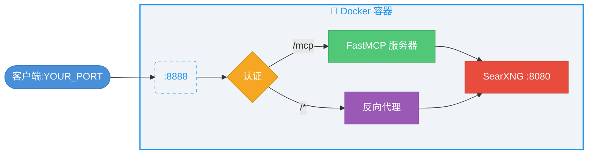

<div align="center">

<picture>
  <source media="(prefers-color-scheme: dark)" srcset="assets/banner-dark.svg">
  <source media="(prefers-color-scheme: light)" srcset="assets/banner-light.svg">
  
</picture>

<p>
  <a href="https://opensource.org/licenses/MIT"></a>
  <a href="https://github.com/whw23/searxng_http_mcp/pkgs/container/searxng-http-mcp"></a>
  <a href="https://github.com/whw23/searxng_http_mcp/actions/workflows/build.yml"></a>
  
  
  
  <a href="https://registry.modelcontextprotocol.io/?q=io.github.whw23/searxng-http-mcp"></a>
  <a href="https://scorecard.dev/viewer/?uri=github.com/whw23/searxng_http_mcp"></a>
</p>

<p>
  <a href="README.md">English</a> ·
  <a href="#-快速开始">快速开始</a> ·
  <a href="#-功能特性">功能特性</a> ·
  <a href="#-架构">架构</a> ·
  <a href="#-与其他方案对比">对比</a> ·
  <a href="#-使用方法">使用方法</a> ·
  <a href="#-mcp-工具参考">MCP 工具</a> ·
  <a href="#-客户端配置">客户端配置</a> ·
  <a href="#-claude-code-插件">插件</a> ·
  <a href="#-贡献">贡献</a>
</p>

</div>

一个自包含的 MCP 服务器，封装了 [SearXNG](https://github.com/searxng/searxng) —— 一个免费、尊重隐私的元搜索引擎，聚合了 200+ 搜索引擎的结果。

---

## 🚀 快速开始

**服务器模式** —— 部署一次，从任何客户端连接：

```bash
docker run -d --name searxng-mcp --restart unless-stopped \
  -p YOUR_PORT:8888 --memory=512m --cpus=1 \
  ghcr.io/whw23/searxng-http-mcp:latest
```

然后[配置客户端](#-客户端配置)连接到 `http://YOUR_HOST:YOUR_PORT/mcp/`。要启用 API Key 认证，请参阅[认证](#-认证)。

**本地模式** —— 无需服务器，直接在客户端中运行：

```bash
docker run --rm -i --memory=512m --cpus=1 ghcr.io/whw23/searxng-http-mcp:latest --stdio
```

将此作为 stdio MCP 服务器添加到客户端中 —— 详见[客户端配置](#-客户端配置)。

## ✨ 功能特性

### 搜索

- 🔍 200+ 搜索引擎 —— 通过 SearXNG 聚合 Google、Bing、DuckDuckGo、Brave 等
- 📂 30+ 分类 —— 新闻、图片、视频、科学、IT 等
- 📄 多页并行获取 —— 每次调用最多 5 页
- 💡 自动补全建议 —— 发现相关搜索词
- 🗂 引擎发现 —— 按分类查询可用引擎
- 🎯 Token 高效 —— 结果精简至核心内容

### 基础设施

- 📦 自包含 —— SearXNG 内置于 Docker 镜像
- 🔄 双传输模式 —— HTTP（Streamable HTTP）和 stdio
- 🔐 认证 —— `x-api-key` + HTTP Basic Auth
- 🌐 反向代理 —— SearXNG Web UI 共用同一端口
- ⚡ 动态工具描述 —— 启动时注入实时分类列表
- 📐 丰富的 JSON Schema —— 每个参数都有枚举约束、范围限制和描述
- 🧩 Claude Code 插件 —— 自托管市场

## 🏛 架构



## 📊 与其他方案对比

<table>
<thead>
  <tr>
    <th>功能</th>
    <th>✨ 本项目</th>
    <th><a href="https://github.com/ihor-sokoliuk/mcp-searxng">mcp-searxng</a></th>
    <th><a href="https://github.com/aicrafted/searxng-mcp">searxng-mcp</a></th>
    <th><a href="https://github.com/burakaydinofficial/searxng-deepdive">searxng-deepdive</a></th>
    <th><a href="https://github.com/exa-labs/exa-mcp-server">exa-mcp-server</a></th>
  </tr>
</thead>
<tbody>
  <tr><td colspan="6"><strong>搜索</strong></td></tr>
  <tr><td>200+ 引擎（SearXNG）</td><td align="center">&#9989;</td><td align="center">&#9989;</td><td align="center">&#9989;</td><td align="center">&#9989;</td><td align="center">&#10060;</td></tr>
  <tr><td>30+ 搜索分类</td><td align="center">&#9989;</td><td align="center">&#10060;</td><td align="center">&#9989;</td><td align="center">&#9989;</td><td align="center">&#10060;</td></tr>
  <tr><td>多页并行获取</td><td align="center">&#9989;</td><td align="center">&#10060;</td><td align="center">&#10060;</td><td align="center">&#9989;</td><td align="center">&#10060;</td></tr>
  <tr><td>自动补全建议</td><td align="center">&#9989;</td><td align="center">&#10060;</td><td align="center">&#10060;</td><td align="center">&#10060;</td><td align="center">&#10060;</td></tr>
  <tr><td>引擎发现工具</td><td align="center">&#9989;</td><td align="center">&#10060;</td><td align="center">&#9989;</td><td align="center">&#10060;</td><td align="center">&#10060;</td></tr>
  <tr><td>动态工具描述</td><td align="center">&#9989;</td><td align="center">&#10060;</td><td align="center">&#10060;</td><td align="center">&#9989;</td><td align="center">&#10060;</td></tr>
  <tr><td colspan="6"><strong>基础设施</strong></td></tr>
  <tr><td>自包含（内置 SearXNG）</td><td align="center">&#9989;</td><td align="center">&#10060;</td><td align="center">&#10060;</td><td align="center">&#10060;</td><td align="center">N/A</td></tr>
  <tr><td>零安装 Docker 部署</td><td align="center">&#9989;</td><td align="center">&#10060;</td><td align="center">&#10060;</td><td align="center">&#10060;</td><td align="center">&#10060;</td></tr>
  <tr><td>HTTP + stdio 传输</td><td align="center">&#9989;</td><td align="center">&#9989;</td><td align="center">&#9989;</td><td align="center">&#10060;</td><td align="center">&#10060;</td></tr>
  <tr><td>认证</td><td align="center">&#9989;</td><td align="center">&#10060;</td><td align="center">&#10060;</td><td align="center">&#10060;</td><td align="center">&#9989;</td></tr>
  <tr><td>Web UI 反向代理</td><td align="center">&#9989;</td><td align="center">&#10060;</td><td align="center">&#10060;</td><td align="center">&#10060;</td><td align="center">&#10060;</td></tr>
  <tr><td>Claude Code 插件</td><td align="center">&#9989;</td><td align="center">&#10060;</td><td align="center">&#10060;</td><td align="center">&#10060;</td><td align="center">&#10060;</td></tr>
  <tr><td colspan="6"><strong>通用</strong></td></tr>
  <tr><td>免费开源</td><td align="center">&#9989;</td><td align="center">&#9989;</td><td align="center">&#9989;</td><td align="center">&#9989;</td><td align="center">&#10060;（付费 API）</td></tr>
  <tr><td>隐私保护（自托管）</td><td align="center">&#9989;</td><td align="center">&#9989;</td><td align="center">&#9989;</td><td align="center">&#9989;</td><td align="center">&#10060;</td></tr>
  <tr><td>语言</td><td align="center">Python</td><td align="center">Node.js</td><td align="center">Python</td><td align="center">Node.js</td><td align="center">TypeScript</td></tr>
</tbody>
</table>

## 📖 使用方法

### 🌐 HTTP 模式（默认）

```bash
# 不启用认证
docker run -d --name searxng-mcp --restart unless-stopped \
  -p YOUR_PORT:8888 --memory=512m --cpus=1 \
  ghcr.io/whw23/searxng-http-mcp:latest

# 启用认证
docker run -d --name searxng-mcp --restart unless-stopped \
  -p YOUR_PORT:8888 --memory=512m --cpus=1 \
  -e API_KEY=your-secret-key \
  ghcr.io/whw23/searxng-http-mcp:latest
```

<table>
<tr><td>🔗 <strong>MCP 端点</strong></td><td><code>http://YOUR_HOST:YOUR_PORT/mcp/</code></td></tr>
<tr><td>🖥 <strong>SearXNG Web UI</strong></td><td><code>http://YOUR_HOST:YOUR_PORT/</code></td></tr>
</table>

### 📡 stdio 模式

```bash
docker run --rm -i --memory=512m --cpus=1 \
  ghcr.io/whw23/searxng-http-mcp:latest --stdio
```

不暴露端口。通过 stdin/stdout 通信。SearXNG 在容器内部运行，供 MCP 工具使用。

### ⚙️ 环境变量

<table>
<thead>
  <tr><th>变量</th><th>默认值</th><th>描述</th></tr>
</thead>
<tbody>
  <tr><td><code>API_KEY</code></td><td><em>（空，不启用认证）</em></td><td>用于认证的 API Key</td></tr>
</tbody>
</table>

### 🔐 认证

当设置了 `API_KEY` 时，所有请求需要以下认证方式之一：

- **`x-api-key` 请求头** —— 用于 MCP 客户端：`x-api-key: your-key`
- **HTTP Basic Auth** —— 用于浏览器

> [!TIP]
> **浏览器登录：** 启用 `API_KEY` 后访问 Web UI 时，浏览器会弹出登录对话框。**用户名留空**，将 API Key 作为**密码**输入。
>
> 

未设置 `API_KEY` 时，所有请求均开放访问。

---

## 🔧 MCP 工具参考

<details>
<summary>🔍 <code>search</code> —— 使用 SearXNG 搜索网络</summary>

<br>

聚合 200+ 搜索引擎的结果，保护隐私。

<table>
<thead>
  <tr><th>参数</th><th>类型</th><th>必填</th><th>默认值</th><th>描述</th></tr>
</thead>
<tbody>
  <tr><td><code>query</code></td><td>string</td><td>是</td><td>——</td><td>搜索查询语句</td></tr>
  <tr><td><code>categories</code></td><td>string</td><td>否</td><td>""</td><td>逗号分隔的分类名称（如 <code>general,news,science</code>）</td></tr>
  <tr><td><code>engines</code></td><td>string</td><td>否</td><td>""</td><td>逗号分隔的引擎名称（如 <code>google,arxiv,wikipedia</code>）</td></tr>
  <tr><td><code>language</code></td><td>string</td><td>否</td><td>""</td><td>搜索语言代码（如 <code>en</code>、<code>zh</code>、<code>ja</code>）</td></tr>
  <tr><td><code>time_range</code></td><td>enum</td><td>否</td><td>null</td><td><code>day</code>、<code>week</code>、<code>month</code>、<code>year</code></td></tr>
  <tr><td><code>safesearch</code></td><td>enum</td><td>否</td><td>0</td><td><code>0</code>=关闭，<code>1</code>=适度，<code>2</code>=严格</td></tr>
  <tr><td><code>pageno</code></td><td>int ≥1</td><td>否</td><td>1</td><td>起始页码</td></tr>
  <tr><td><code>pages</code></td><td>int 1–5</td><td>否</td><td>1</td><td>并行获取的页数</td></tr>
  <tr><td><code>max_results</code></td><td>int 1–100</td><td>否</td><td>10</td><td>最大返回结果数</td></tr>
  <tr><td><code>format</code></td><td>enum</td><td>否</td><td>compact</td><td><code>compact</code>（标题/链接/内容）或 <code>full</code>（+ 引擎/评分/分类/日期）</td></tr>
</tbody>
</table>

**返回：** 搜索结果、直接答案、建议、纠正、信息框。

</details>

<details>
<summary>💡 <code>autocomplete</code> —— 获取搜索建议</summary>

<br>

<table>
<thead>
  <tr><th>参数</th><th>类型</th><th>必填</th><th>描述</th></tr>
</thead>
<tbody>
  <tr><td><code>query</code></td><td>string</td><td>是</td><td>用于获取建议的部分查询字符串</td></tr>
</tbody>
</table>

</details>

<details>
<summary>🗂 <code>engine_info</code> —— 发现可用引擎和分类</summary>

<br>

无参数。返回按分类分组的已启用引擎列表。

**返回：**

```json
{
  "categories": ["general", "images", "videos", "news", ...],
  "engines": ["google", "bing", "duckduckgo", ...],
  "category_engines": {
    "general": ["google", "bing", "duckduckgo", "brave", ...],
    "science": ["arxiv", "google scholar", "pubmed", ...],
    ...
  }
}
```

使用此工具在调用 `search` 时指定特定的 `engines` 或 `categories` 过滤器之前，先发现有哪些引擎可用。

</details>

---

## 🔌 客户端配置

<details>
<summary> <b>Claude Desktop</b></summary>

**服务器模式** —— 编辑 `~/Library/Application Support/Claude/claude_desktop_config.json`：

```json
{
  "mcpServers": {
    "searxng": {
      "url": "http://YOUR_HOST:YOUR_PORT/mcp/",
      "headers": {
        "x-api-key": "your-secret-key"
      }
    }
  }
}
```

**本地模式**：

```json
{
  "mcpServers": {
    "searxng": {
      "command": "docker",
      "args": ["run", "--rm", "-i", "--memory=512m", "--cpus=1", "ghcr.io/whw23/searxng-http-mcp:latest", "--stdio"]
    }
  }
}
```

</details>

<details>
<summary> <b>Claude Code</b></summary>

**服务器模式**：

```bash
claude mcp add --transport http --header "x-api-key: your-secret-key" searxng http://YOUR_HOST:YOUR_PORT/mcp/
```

**本地模式**：

```bash
claude mcp add --transport stdio searxng -- docker run --rm -i --memory=512m --cpus=1 ghcr.io/whw23/searxng-http-mcp:latest --stdio
```

</details>

<details>
<summary> <b>Codex</b></summary>

**服务器模式** —— 添加到 `~/.codex/config.toml`：

```toml
[mcp_servers.searxng]
url = "http://YOUR_HOST:YOUR_PORT/mcp/"
http_headers = { "x-api-key" = "your-secret-key" }
```

**本地模式**：

```toml
[mcp_servers.searxng]
command = "docker"
args = ["run", "--rm", "-i", "--memory=512m", "--cpus=1", "ghcr.io/whw23/searxng-http-mcp:latest", "--stdio"]
```

</details>

<details>
<summary> <b>Cursor</b></summary>

**服务器模式** —— 编辑 `.cursor/mcp.json`：

```json
{
  "mcpServers": {
    "searxng": {
      "url": "http://YOUR_HOST:YOUR_PORT/mcp/",
      "headers": {
        "x-api-key": "your-secret-key"
      }
    }
  }
}
```

**本地模式**：

```json
{
  "mcpServers": {
    "searxng": {
      "command": "docker",
      "args": ["run", "--rm", "-i", "--memory=512m", "--cpus=1", "ghcr.io/whw23/searxng-http-mcp:latest", "--stdio"]
    }
  }
}
```

</details>

<details>
<summary> <b>VS Code Copilot</b></summary>

**服务器模式** —— 添加到 `.vscode/mcp.json`：

```json
{
  "servers": {
    "searxng": {
      "type": "http",
      "url": "http://YOUR_HOST:YOUR_PORT/mcp/",
      "headers": {
        "x-api-key": "your-secret-key"
      }
    }
  }
}
```

**本地模式**：

```json
{
  "servers": {
    "searxng": {
      "type": "stdio",
      "command": "docker",
      "args": ["run", "--rm", "-i", "--memory=512m", "--cpus=1", "ghcr.io/whw23/searxng-http-mcp:latest", "--stdio"]
    }
  }
}
```

</details>

<details>
<summary> <b>Windsurf</b></summary>

**服务器模式** —— 添加到 `~/.codeium/windsurf/mcp_config.json`：

```json
{
  "mcpServers": {
    "searxng": {
      "serverUrl": "http://YOUR_HOST:YOUR_PORT/mcp/",
      "headers": {
        "x-api-key": "your-secret-key"
      }
    }
  }
}
```

**本地模式**：

```json
{
  "mcpServers": {
    "searxng": {
      "command": "docker",
      "args": ["run", "--rm", "-i", "--memory=512m", "--cpus=1", "ghcr.io/whw23/searxng-http-mcp:latest", "--stdio"]
    }
  }
}
```

</details>

<details>
<summary> <b>Cline</b></summary>

通过 VS Code 中 Cline 的 MCP 设置面板配置（`Cline > MCP Servers > Add`）。

**服务器模式**：

```json
{
  "mcpServers": {
    "searxng": {
      "url": "http://YOUR_HOST:YOUR_PORT/mcp/",
      "headers": {
        "x-api-key": "your-secret-key"
      }
    }
  }
}
```

**本地模式**：

```json
{
  "mcpServers": {
    "searxng": {
      "command": "docker",
      "args": ["run", "--rm", "-i", "--memory=512m", "--cpus=1", "ghcr.io/whw23/searxng-http-mcp:latest", "--stdio"]
    }
  }
}
```

</details>

<details>
<summary> <b>OpenCode</b></summary>

**服务器模式** —— 编辑 `opencode.json`：

```json
{
  "mcp": {
    "searxng": {
      "type": "remote",
      "url": "http://YOUR_HOST:YOUR_PORT/mcp/",
      "headers": {
        "x-api-key": "your-secret-key"
      }
    }
  }
}
```

**本地模式**：

```json
{
  "mcp": {
    "searxng": {
      "type": "local",
      "command": ["docker", "run", "--rm", "-i", "--memory=512m", "--cpus=1", "ghcr.io/whw23/searxng-http-mcp:latest", "--stdio"]
    }
  }
}
```

</details>

<details>
<summary> <b>Hermes Agent</b></summary>

**服务器模式** —— 编辑 `~/.hermes/config.yaml`：

```yaml
mcp_servers:
  searxng:
    url: "http://YOUR_HOST:YOUR_PORT/mcp/"
    headers:
      x-api-key: "your-secret-key"
```

**本地模式**：

```yaml
mcp_servers:
  searxng:
    command: "docker"
    args: ["run", "--rm", "-i", "--memory=512m", "--cpus=1", "ghcr.io/whw23/searxng-http-mcp:latest", "--stdio"]
```

</details>

---

## 🧩 Claude Code 插件

添加市场，然后安装适合你环境的插件：

```bash
/plugin marketplace add whw23/searxng_http_mcp
```

两个插件都包含 🔍 `/web-search-via-searxng` 技能用于网络搜索。

<details>
<summary>🐳 <b>本地模式</b> —— Docker stdio，零配置</summary>

<br>

```bash
/plugin install searxng-http-mcp@searxng-http-mcp
```

通过 stdio 在本地 Docker 容器中运行 SearXNG。需要已安装 Docker。

</details>

<details>
<summary>🌐 <b>远程模式</b> —— 通过 HTTP 连接已部署的服务器</summary>

<br>

```bash
/plugin install searxng-http-mcp@searxng-http-mcp-remote
```

连接到已部署的 SearXNG MCP 服务器。需要设置环境变量 `SEARXNG_MCP_URL` 和 `SEARXNG_API_KEY`。

添加到 `~/.claude/settings.json` 的 `env` 字段：

```json
{
  "env": {
    "SEARXNG_MCP_URL": "http://YOUR_HOST:YOUR_PORT/mcp/",
    "SEARXNG_API_KEY": "your-api-key"
  }
}
```

然后重启 Claude Code。

</details>

---

## 🛠 SearXNG 配置

<details>
<summary>🖥 <b>通过 Web UI</b></summary>

<br>

访问 `http://YOUR_HOST:YOUR_PORT/` 的 SearXNG Web UI 来配置搜索引擎、语言和其他设置。更改在容器生命周期内持续有效。

</details>

<details>
<summary>💾 <b>通过卷挂载</b> —— 持久化配置</summary>

<br>

挂载 SearXNG 配置目录以实现持久化配置：

```bash
docker run -d --name searxng-mcp --restart unless-stopped \
  -p YOUR_PORT:8888 --memory=512m --cpus=1 \
  -v /path/to/searxng-config:/etc/searxng \
  ghcr.io/whw23/searxng-http-mcp:latest
```

SearXNG 在首次启动时生成 `settings.yml`。容器会自动启用 MCP 工具所需的 JSON 格式输出。

</details>

---

## 🏗 从源码构建

```bash
git clone https://github.com/whw23/searxng_http_mcp.git
cd searxng_http_mcp
docker build -t searxng-http-mcp:local .
docker run -d --name searxng-mcp --restart unless-stopped \
  -p YOUR_PORT:8888 --memory=512m --cpus=1 \
  searxng-http-mcp:local
```

## 🤝 贡献

请参阅 **[CONTRIBUTING.md](CONTRIBUTING.md)** 获取完整的工作流、CI 要求和开发环境搭建说明。

1. 🍴 Fork 仓库并在你的 Fork 中启用 GitHub Actions
2. 🌿 从 `dev` 分支创建功能分支
3. ✍️ 进行修改
4. ✅ 运行测试：`pytest tests/ -v` —— 在提交 PR 之前，CI 必须在你的 Fork 中通过
5. 📬 向 `dev` 提交 PR

开发工作在 `dev` 分支进行。合并到 `main` 会触发镜像构建。

## 📄 许可证

[MIT](LICENSE) —— MCP 服务器代码。

[SearXNG](https://github.com/searxng/searxng) 本身基于 [AGPL-3.0-or-later](https://github.com/searxng/searxng/blob/master/LICENSE) 许可。
